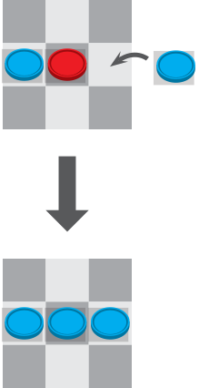
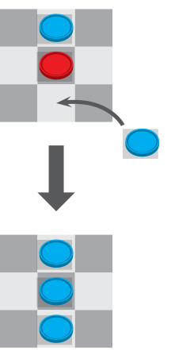
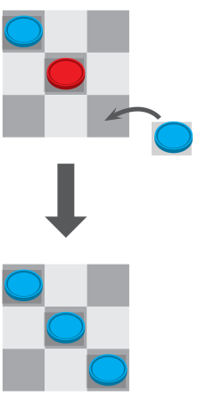
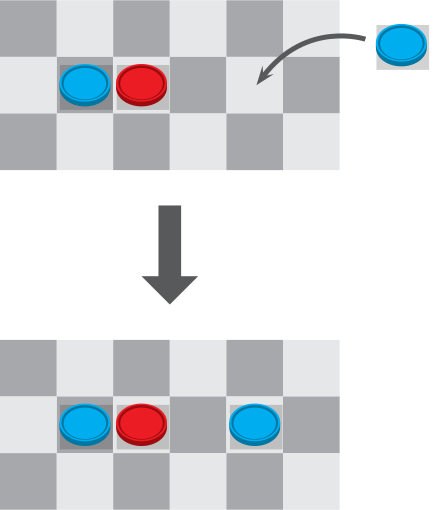
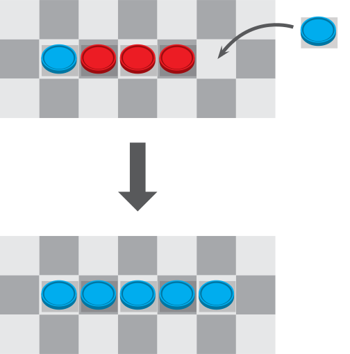
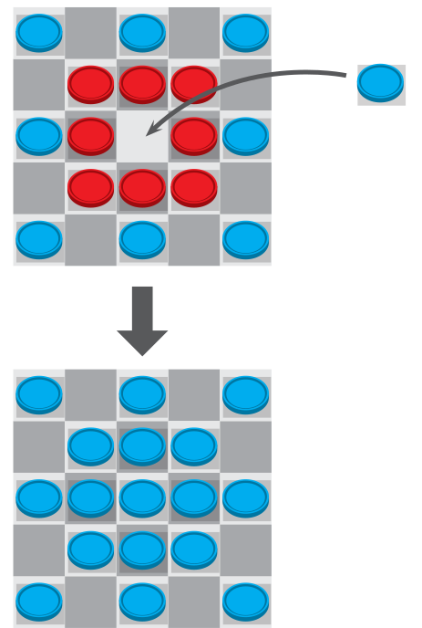

# ThrowReversi

ThrowReversi is a simplified version of the Reversi (Othello) game, but instead of placing disks on a small board, the players need to throw small bags from a certain distance onto a huge board.
The game is best explained by watching [this video](https://www.youtube.com/watch?v=BXUfnJKLoNQ).

## Rules of play

Players alternatively throw one bag onto the game board, regardless whether they actually hit a tile.

The following rules apply:

**Rule #0**: When a player hits an empty tile, s/he conquers it.

**Rule #1**: When a player manages to surround an enemy tile with two of his own in a straight line, s/he will conquer the enemy tile.

  

**Rule #2**: No tiles will be conquered if there is an empty tile (or an own tile) in-between.

**Rule #3**: Multiple enemy tiles can be conquered that way, if all of them are enclosed by own tiles.

**Rule #4**: Conquering can occur in multiple directions at the same time.

## Install

ThrowReversi has been designed for the [Kniwwelino](http://www.kniwwelino.lu/), even though it can be run on every ESP8266-compatible board.

To install ThrowReversi on your Kniwwelino, follow these steps:

1. Prepare your Kniwwelino for use with the Arduino IDE (https://doku.kniwwelino.lu/en/installationarduino)
2. Clone this repository and open it with the Arduino IDE
3. Install the dependencies (see below)
4. Flash it onto your Arduino

Required Arduino libraries (unpack into `./libraries` folder):

* __Keypad__ by Mark Stanley, Alexander Brevig: http://playground.arduino.cc/Code/Keypad
* __Adafruit NeoPixel__ by Adafruit: https://github.com/adafruit/Adafruit_NeoPixel

## How to use

1. Connect the ground and data pins of LED strip to the `GND` and `D6` pins of the Kniwwelino, respectively.
2. Power the LED strip and the Kniwwelino. The status LED of the Kniwwelino will turn white, then green (indicating that it is ready).
3. Connect your smart phone to the "ThrowReversi" WiFi network. It is (intentionally) an open/unencrypted network, so no passphrase is necessary.
4. On your smart phone, open a web browser and navigate to http://throwreversi/.

The web interface will show up on your phone.
First select a player (blue or red), then tap on one of the 6x6 tiles to mark it as conquered by the selected player.
The game logic will be applied automatically.

There is also the "Edit mode", which will disable all game logic, and let you change the owner of every tile.
It is meant to be used if a tile has been mistakenly conquered by a wrong player.

## License

The software contained in this repository is licensed under an MIT license.
Please read the [LICENSE](LICENSE.md) file for more information.
